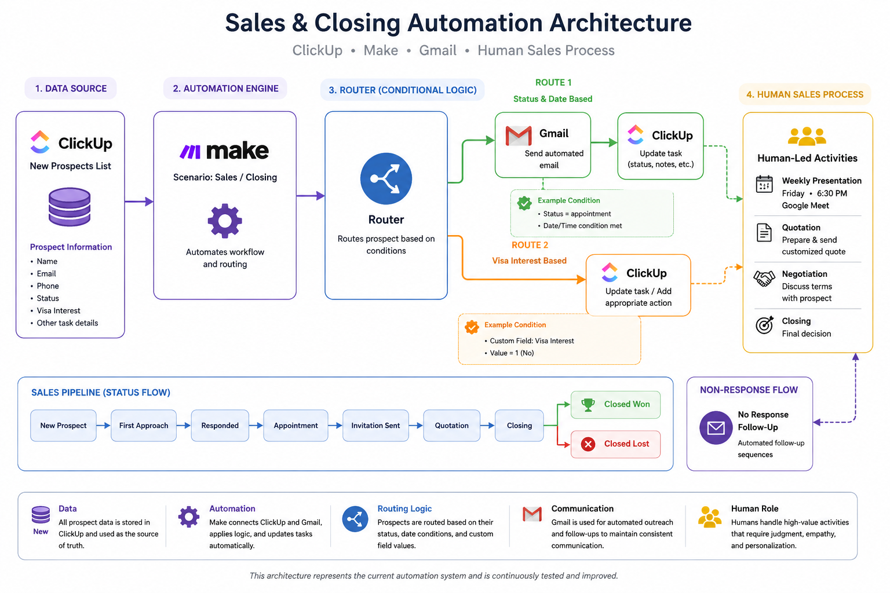

# Sales & Closing Automation

A practical sales automation workflow built with **Make, ClickUp, and Gmail** to manage prospects from initial outreach through follow-up and closing.

## 🚀 Project Overview

This project demonstrates how a small business can automate repetitive sales operations while keeping important human interactions under manual control.

The system manages prospect information in ClickUp, automates email communication through Gmail, and uses Make to connect the workflow.

## 🛠️ Tools & Technologies

* **Make** — Workflow automation and routing
* **ClickUp** — CRM-style prospect and sales pipeline management
* **Gmail** — Automated prospect communication
* **GitHub** — Documentation and project version control

## 🔄 Sales Automation

The overall workflow is designed around these stages:

```text id="5nq9fz"
NEW PROSPECT
     ↓
FIRST APPROACH
     ↓
RESPONDED
     ↓
APPOINTMENT
     ↓
INVITATION SENT
     ↓
QUOTATION
     ↓
CLOSING
     ↓
CLOSED WON / CLOSED LOST
```

Prospects who do not respond are handled through a separate follow-up process.

## 📧 Automated Communication

The workflow can automate:

* Initial prospect outreach
* Reply detection
* No-response follow-up
* Presentation invitations
* Sales-stage follow-ups

The system is designed to prevent unnecessary duplicate communication by using ClickUp status changes and routing conditions.

## 📅 Weekly Presentation Workflow

Interested prospects are invited to a recurring online presentation.

**Presentation schedule:**

* **Day:** Friday
* **Time:** 6:30 PM
* **Platform:** Google Meet

Invitation emails are prepared automatically while the actual presentation remains a human-led sales activity.

## 🤝 Human + Automation Workflow

Not every part of the sales process should be automated.

### Automation handles

* Prospect routing
* Email communication
* Reply detection
* Follow-up timing
* ClickUp status updates
* Sales pipeline organization

### Human handles

* Determining whether a prospect is genuinely interested
* Conducting the Google Meet presentation
* Preparing customized quotations
* Negotiation
* Final closing decisions

This approach keeps automation efficient while preserving human involvement where judgment and personalization are important.

## 🧩 ClickUp Custom Fields

The workflow uses ClickUp custom fields to store prospect information.

One important field is:

**Visa Interest**

Values:

* Yes
* No

The Make workflow reads the actual task-level custom-field value when making routing decisions.

## 🧪 Testing

The workflow has been developed and tested using test prospects before live deployment.

Testing focuses on:

* Bundle flow
* Filters
* Custom-field mapping
* Gmail email delivery
* ClickUp task updates
* Status-based routing
* Duplicate-prevention logic

## 🎯 Project Goal

The goal is to demonstrate a practical, maintainable sales automation system that reduces repetitive administrative work while allowing the business owner to remain in control of important client interactions.

## 🏗️ Architecture



## 📁 Documentation

Detailed documentation is available in:

* [`docs/automation-overview.md`](docs/automation-overview.md)
* [`docs/workflow.md`](docs/workflow.md)

## 💼 Portfolio Use

This project demonstrates practical experience with:

* No-code automation
* CRM workflow design
* API-connected business applications
* Conditional routing
* Email automation
* Data mapping
* Custom-field handling
* Sales pipeline automation
* Human-in-the-loop workflows
